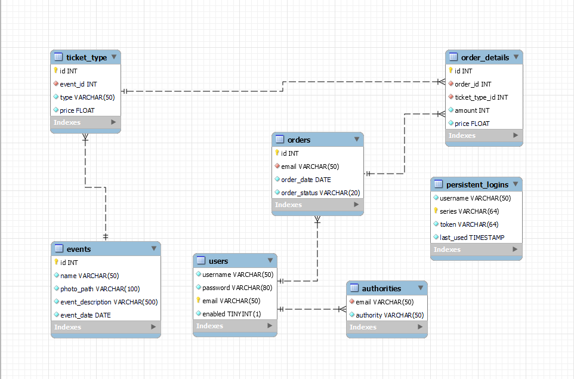

# Ticket System
This project contains a simple ticket system with feature like registration 
and buying tickets. The project is created for learning purposes, therefore
might not contain all functions you would expect.

### Readme in progress.
## Features
Project features:
* Register and login page with spring security.
* Admin site for managing events and users.
* User site for checking events and buying tickets.  
* Shopping cart for buying multiple items at once
  
MySQL is used as database for storing data however there should be no error
while using other database, all pages are written in html with thymeleaf.

## Installing/getting started
After downloading and unpacking you need to configure your database accordingly
to this ERD:  After setting database, remember to put correct 
properties in your application.properties file. It is also advised to create 
manually first account with admin role to manage have access to admin site of 
app. After that, you can run this app with command:
```
    mvn spring-boot:run
```